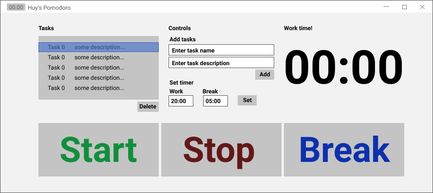

# A Simple pomodoro timer
I wanted to make my own pomodoro timer to use for my daily productivity stuff.

I'll be using PySimpleGUI and the time standard libraries for version 0.

Here's a rough idea of what version 0 should look like...lol 90s UX design:

The application has 4 main components;
1. A task queue widget where users can delete tasks
2. Controls widget which allows users to add tasks, set the work time and break time
3. The active timer widget
4. Start, stop and break buttons

The user can create a task, add it to the queue and start the timer. When the timer ends the task queue is updated by deleting the latest task (top of queue). By default, at the end of each work timer the break timer will then start. A user can stop the timer or enter break at any time. 

## To do:
* write logic and app component modules
* write unit test fixtures and test with pytest
* test/debug
* compile binaries and package for installation
* deploy
