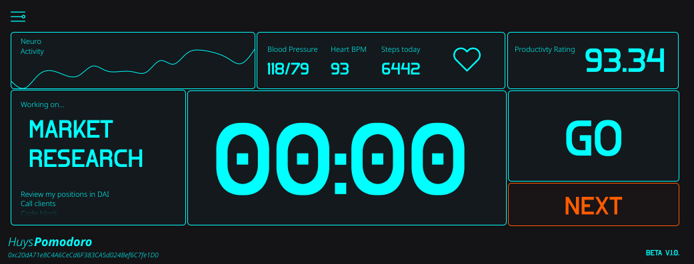
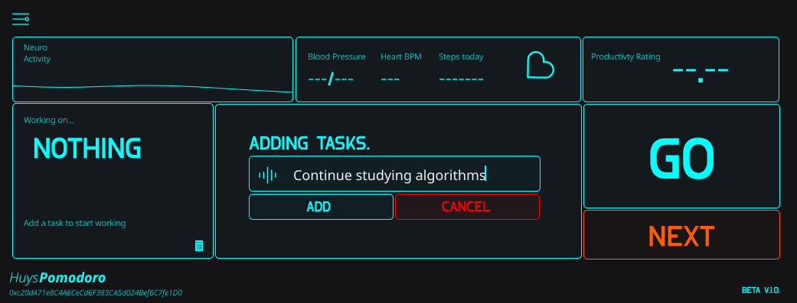

# A Simple pomodoro timer
I'm making my own pomodoro timer to use for my daily productivity stuff. I'll be using PySimpleGUI and the time standard libraries for this project.

If you don't know what a pomodoro timer is here's an explanation of the technique in practice:
https://en.wikipedia.org/wiki/Pomodoro_Technique

Timer looks something like this.

And ui plus health tracking information

Task creation view

### Features
First build;
1. A queueing routine.
2. A timer.
3. A bluetooth api.
4. Some state.
5. A key productivity rating measure averaged during a session.
6. Controls - Go, Stop and Next buttons.
7. Application settings.

# Just a really nice desktop productivity app
I wanted to build something I could use everyday in my own life and I wanted it to be high performant, functional and simple.

## To do:
* <s>Finish v1 designs</s>
* write logic and app component modules
* write unit test fixtures and test with pytest
* test/debug
* compile binaries and package for installation
* deploy
